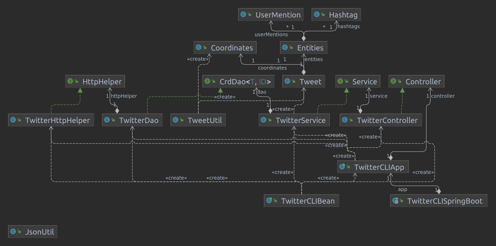
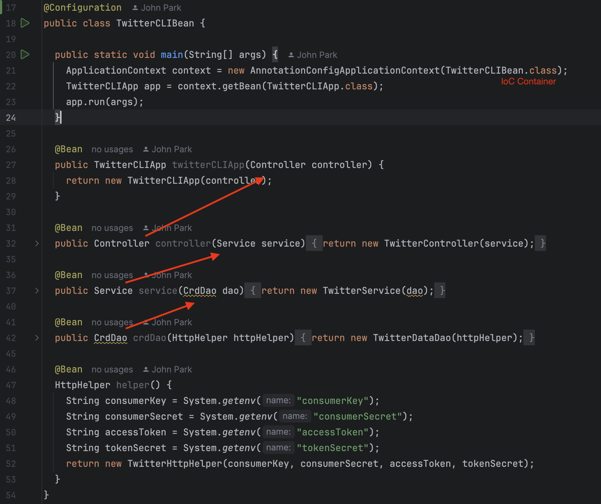
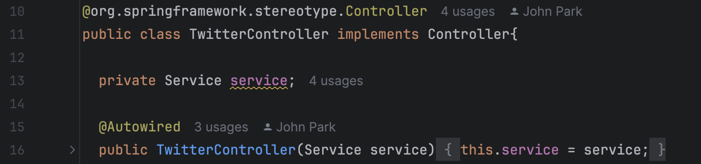
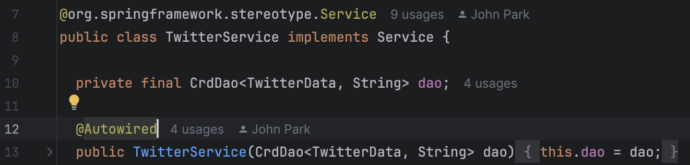
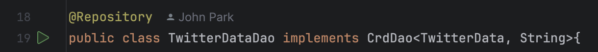
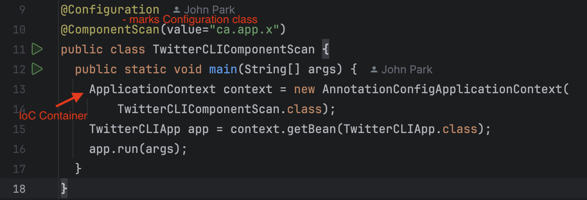
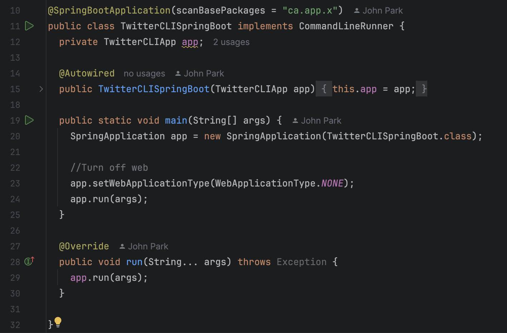

# X CRD Application

* [Introduction](#Introduction)
* [Quick Start](#Quick-Start)
* [Design](#Design)
* [Spring](#Spring)
* [Test](#Test)
* [Deployment](#Deployment)

## Introduction

<a id=Introduction ></a>

This is a Java application that interacts with the RESTful X API to create, read, or delete (CRD) tweets. The application performs each operation by making a corresponding HTTP request to the X API and then parsing and processing the HTTP response received.

`Maven` is used to manage dependencies and structure the project's directory. `Jackson` is utilized to map JSON strings to Java objects. `JUnit` and `Mockito` are employed for thorough unit and integration testing. Finally, the project is deployed using `Docker`.

The primary purpose of this project was to familiarize myself with the Spring Framework. Through this project, I learned about the mechanisms behind Inversion of Control (IoC) and Dependency Injection (DI), as well as how the Spring Framework implements IoC and DI to organize application components. The Spring section below will demonstrate different ways Spring can be implemented and how each method manages application components.

## Quick Start

<a id=Quick-Start ></a>

First, clone the app to your local machine. Then, set the environment variables for OAuth 1.0a

* `consumerKey`: The Consumer Key or called API key
* `consumerSecret`: Consumer Secret or called API secret key
* `accessToken`: The Access Token for read and write access
* `tokenSecret`: The Secret Key for access token

Then, package your application through mvn:

```bash
mvn clean package
```

Above input to the terminal at the directory of the app will generate Uber JAR. Then, run the application through following command:

```bash
java -jar x_crd-1.0-SNAPSHOT.jar post|show|delete [options]
```

Another way to run this would be to pull the docker image `johnphk/x-crd-app` from dockerhub. Then, run the following command:

```bash
docker run --rm \            
    -e consumerKey=<Consumer Key from X API> \
    -e consumerSecret=<Consumer Secret from X API> \
    -e accessToken=<Access Token from X API> \
    -e tokenSecret=<Token Secret from X API> \
    johnphk/x-crd-app post|show|delete <Status Message>
```

## Design

<a id=Design ></a>

### UML diagram



#### App/Main

This class serves as the initial entry point of the application to perform post, show or delete a status message. It parses the command-line arguments and invokes a controller to execute the post, show, or delete operations on X.

#### Controller

This class represents the controller component of MVC architecture. Based on the command-line argument received from the App/Main class, it invokes the corresponding method of service class to perform CRD operation.

#### Service

This class represents the service layer, which acts as an intermediary between the controller and the data layer. It handles business logic and calls the DAO to retrieve or update data on X. Additionally, it performs sanity checks to ensure no unsupported data is passed to the X API.

#### DAO

The DAO represents the data layer in the application architecture. It directly interacts with the X API to retrieve or update data on X. It achieves this by constructing a URI that maps to the Create, Read, or Delete operations for the data on X.

#### Model

The model is designed to represent the JSON data received as a response from X API.

For example,

```json
{
    "data": {
        "edit_history_tweet_ids": [
            "1890255049797841060"
        ],
        "id": "1890255049797841060",
        "text": "Hello Hello MY FRIENDS 2025"
    }
}
```

To represent JSON data as shown above, two model classes are implemented: TwitterData.java and Data.java. TwitterData.java serves as a wrapper class representing an entire response from the X API, while Data.java represents the values mapped from the data key.

## Spring

<a id=Spring ></a>

In Spring framework, the two most fundamental components are Inversion of Control (IoC) container, and Beans. In this application, `TwitterController`, `TwitterService`, `TwitterDao`, and `TwitterHttpHelper` are Beans created by the main method and managed by the IoC Container. In below, it demonstrates how different approach of Spring usage is applied in the code.

* `@Beans` approach

    This is the most legacy approach to build a backbone of Spring application.
    \
    
    \
    `@Configuration` makes `TwitterCLIBean` the config file determining overall dependency relationship of the application. Inside the class, each method with `@Beans` represent an individual dependency relationship between the input and the output class. Note that beans are directly injected into another bean through boilerplate code.
    <br/>

* `@ComponentScan` approach
    
    In this approach, `@Autowire` annotation is used to command IoC container to inject dependency through the constructor.
    \
    `@Controller` is used to mark the controller of the MVC architecture.
    \
    
    \
    `@Service` is used to mark the service layer of the MVC architecture.
    \
    
    \
    `@Repository` is used to mark the data layer.
    \
    
    \
    Finally, below is how main method is implemented to summon a IoC container and initiate the application.
    \
    
    <br/>

* `Springboot` approach
  
    In the last approach, Springboot was used for faster and more efficient development of the application.
    \
    

## Test

<a id=Test ></a>

The frameworks used to test this application are `JUnit 4` and `Mockito`. Integration tests and unit tests were written for each class to verify both the functionality of multiple classes as a group and the behavior of individual class methods.

Integration testing was implemented for each class to ensure proper functionality when interacting with dependent class objects and the X API. It verified that cross-class method interactions worked without issues.

Unit testing focused on testing the functionality of each method in isolation. `Mockito` was used to mock dependencies, allowing the behavior of a class to be tested independently of other components.

## Deployment

<a id=Deployment ></a>

The application was dockerized after generating an `uber JAR` using Maven. Docker was used to containerize the `uber JAR`, and the image was then pushed to the Docker Hub repository. The containerization process involved creating a `Dockerfile` and using openjdk:8-alpine as the base image, where the application was installed and run. *(Note: openjdk:8-alpine is the bare minimum required to run any Java 8 application.)*

The steps involved in dockerization and deployment are as follows:

```Bash
# Build the uber jar
mvn clean package

# Create the image
docker built -t <username>/twitter .

# Push the image to the docker hub - deployment
docker push <username>/twitter
```
